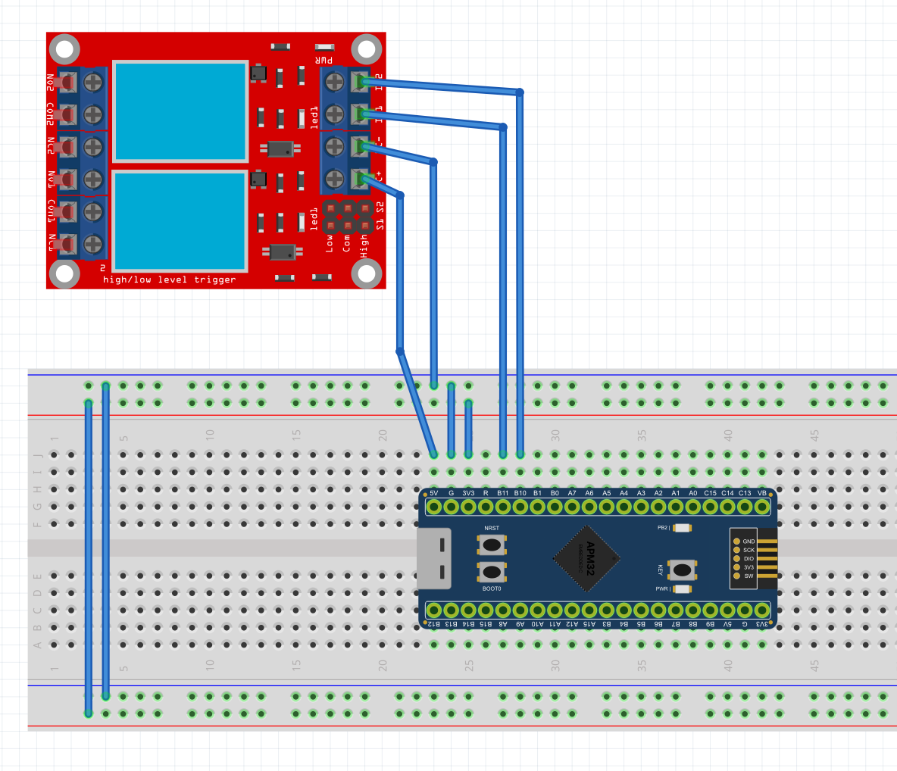

# Tutorial 3: Driving a Relay Module 

**Objective:** Use a GPIO pin as a **trigger signal** (not a power source) to switch a real-world AC/DC load through an opto-isolated relay module, and understand **active-low trigger logic**.

**Based on the Fritzing Diagram:**


**Hardware used:** 2-Channel Opto-Isolated Relay Module (5V coil, up to 10A / 250VAC or 30VDC per channel).

- **Relay 1 Signal (IN1):** `PB11`
- **Relay 2 Signal (IN2):** `PB10`
- **Module VCC:** `5V` (the relay coil needs 5V — **not** `3V3`)
- **Module GND:** `G`

> [NOTE]
> **Why 5V and not 3V3?**
> `PB10`/`PB11` only carry the small *trigger* signal (15–20mA) into the module's own opto-isolator and transistor driver — the MCU never switches the coil current directly. But the coil itself needs a full 5V to pull in, so the module's `VCC`/`GND` terminals must go to the board's `5V`/`G` pins, separate from the signal wires. This opto-isolation is also what keeps a fault on the switched (AC/DC load) side from ever reaching back into your MCU.

> [NOTE]
> **Hardware Variation: Trigger Level Jumper**
> Most of these modules ship with a 3-pin jumper (`Low` / `Com` / `High`) next to each channel. In the **default "Low Level Trigger"** position (the one assumed below), sending a `0` to the signal pin energizes the relay, and a `1` de-energizes it — the opposite of what you'd instinctively expect from a simple LED. If your module's jumper is set to `High`, just remove the `~` / swap the `|=`↔`&=~` pairs in the code below.

> [WARNING]
> If you wire the **NO/COM/NC** screw terminals to mains AC (110V/220V) to switch a real appliance, that side of the circuit is lethal. Never touch the terminal block or exposed wiring while it's plugged into the wall. For classroom testing, it is much safer to just listen for the audible *click* and watch the relay's own onboard LED — no external load needed at all.

---

## Step 1: Configuring Registers in `main.c`

Both signal pins live in the **high half** of Port B (`PB10`, `PB11`), so both are configured through `CFGHIG`, exactly like the buttons in Tutorial 1. Each pin gets its own 4-bit field inside that register — 2 bits pick the **mode** (speed), 2 bits pick the **configuration** (push-pull vs. open-drain, etc.). Here's exactly what those two `0x3` nibbles below actually set:

<div style="overflow-x:auto; margin: 1.5em 0;">
<svg viewBox="0 0 648 190" width="100%" style="max-width: 648px; display:block; margin: 0 auto; font-family: 'Inconsolata', monospace;" role="img" aria-label="CFGHIG register bit layout for PB11 (bits 15-12) and PB10 (bits 11-8), each set to 0x3: MODE=11 (50MHz output), CNF=00 (push-pull)">
  <!-- PB11 nibble (bits 15-12) -- 4 boxes of width 72 starting at x=24, so this
       nibble spans 24 to 312. PB10's nibble starts at 336 (a deliberate 24px
       gap after 312, not touching it) -- these two numbers (312 and 336)
       must stay in sync with the rect/text x's below if this ever gets edited. -->
  <text x="168" y="14" text-anchor="middle" font-size="12" font-weight="700" fill="var(--accent-text)">PB11 -- bits 15..12</text>
  <path d="M 24 22 L 24 30 L 312 30 L 312 22" fill="none" stroke="var(--accent-text)" stroke-width="1.5"/>
  <!-- PB10 nibble (bits 11-8) -->
  <text x="480" y="14" text-anchor="middle" font-size="12" font-weight="700" fill="var(--success-text)">PB10 -- bits 11..8</text>
  <path d="M 336 22 L 336 30 L 624 30 L 624 22" fill="none" stroke="var(--success-text)" stroke-width="1.5"/>
  <!-- Bit index labels (MSB to LSB: 15 14 13 12 11 10 9 8) -->
  <g font-size="11" fill="var(--sidebar-text)" text-anchor="middle">
    <text x="60" y="46">15</text><text x="132" y="46">14</text><text x="204" y="46">13</text><text x="276" y="46">12</text>
    <text x="372" y="46">11</text><text x="444" y="46">10</text><text x="516" y="46">9</text><text x="588" y="46">8</text>
  </g>
  <!-- Value boxes: 0 0 1 1 | 0 0 1 1 -- 0x3 read as CNF1,CNF0,MODE1,MODE0 in each nibble -->
  <g stroke="var(--border-color)" stroke-width="1.5">
    <rect x="24"  y="54" width="72" height="44" fill="none"/>
    <rect x="96"  y="54" width="72" height="44" fill="none"/>
    <rect x="168" y="54" width="72" height="44" fill="var(--sidebar-bg)"/>
    <rect x="240" y="54" width="72" height="44" fill="var(--sidebar-bg)"/>
    <rect x="336" y="54" width="72" height="44" fill="none"/>
    <rect x="408" y="54" width="72" height="44" fill="none"/>
    <rect x="480" y="54" width="72" height="44" fill="var(--sidebar-bg)"/>
    <rect x="552" y="54" width="72" height="44" fill="var(--sidebar-bg)"/>
  </g>
  <g font-size="16" font-weight="700" fill="var(--text-main)" text-anchor="middle">
    <text x="60" y="83">0</text><text x="132" y="83">0</text><text x="204" y="83">1</text><text x="276" y="83">1</text>
    <text x="372" y="83">0</text><text x="444" y="83">0</text><text x="516" y="83">1</text><text x="588" y="83">1</text>
  </g>
  <!-- CNF/MODE sub-labels under each bit -->
  <g font-size="9" fill="var(--text-muted)" text-anchor="middle">
    <text x="60" y="112">CNF1</text><text x="132" y="112">CNF0</text><text x="204" y="112">MODE1</text><text x="276" y="112">MODE0</text>
    <text x="372" y="112">CNF1</text><text x="444" y="112">CNF0</text><text x="516" y="112">MODE1</text><text x="588" y="112">MODE0</text>
  </g>
  <!-- Legend -->
  <g font-size="12" fill="var(--text-main)">
    <text x="24" y="145">0x3 = 0b0011 per nibble:</text>
    <text x="24" y="164" fill="var(--text-muted)">MODE[1:0] = 11 -&gt; Output, 50MHz max speed</text>
    <text x="24" y="182" fill="var(--text-muted)">CNF[1:0]  = 00 -&gt; General purpose Push-Pull</text>
  </g>
</svg>
</div>

Insert this inside the `/* USER CODE BEGIN Init */` block:

```c
/* USER CODE BEGIN Init */

// 1. Enable Clock for Port B
RCM->APB2CLKEN |= (1 << 3);

// 2. Configure PB10 and PB11 as 50MHz Push-Pull Outputs (0x3)
// PB10 sits at bits 8-11 of CFGHIG, PB11 at bits 12-15.
GPIOB->CFGHIG &= ~((0xF << 8) | (0xF << 12));
GPIOB->CFGHIG |=  ((0x3 << 8) | (0x3 << 12));

// 3. Start with BOTH relays de-energized.
// This is a "Low Level Trigger" module: a LOW (0) signal closes the
// transistor and pulls in the coil. Sending a 1 keeps it OFF, so we
// must initialize both pins HIGH before the loop even starts.
GPIOB->ODATA |= (1 << 10) | (1 << 11);

/* USER CODE END Init */
```

---

## Step 2: Switching the Relays in the Main Loop

Insert this inside the `/* USER CODE BEGIN While */` block. This sequentially pulses each relay ON for one second, one at a time:

```c
        /* USER CODE BEGIN While */

        // --- RELAY 1 (PB11) ---
        GPIOB->ODATA &= ~(1 << 11); // LOW = energize (turn ON)
        delay_ms(1000);
        GPIOB->ODATA |=  (1 << 11); // HIGH = de-energize (turn OFF)
        delay_ms(1000);

        // --- RELAY 2 (PB10) ---
        GPIOB->ODATA &= ~(1 << 10);
        delay_ms(1000);
        GPIOB->ODATA |=  (1 << 10);
        delay_ms(1000);

        /* USER CODE END While */
```
